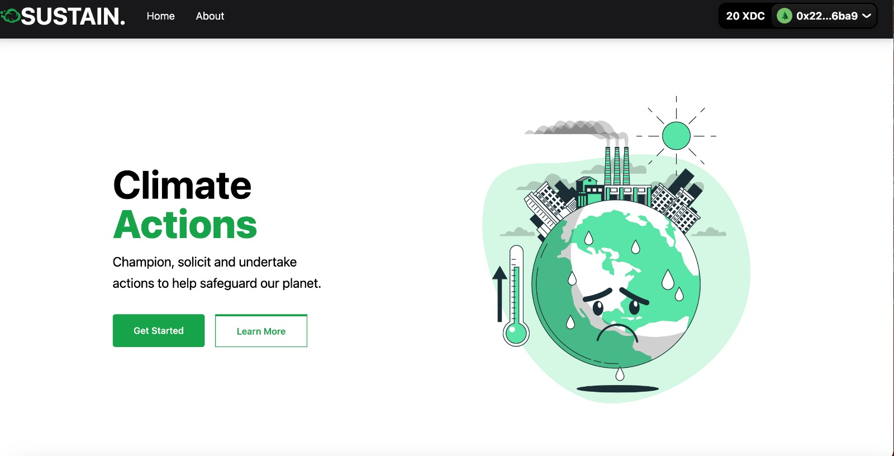

<div align="center">
    

<h3 align="center">Sustain</h3>

<p align="center">
    Carbon Offsetting platform with CO2.Storage and Blockchain!
    <br />
    <a href="https://github.com/mendsalbert/sustain"><strong>Explore the docs »</strong></a>
    <br />
    <br />

</p>

</div>

<!-- ABOUT THE PROJECT -->

## About The Project



# What it does

Imagine that there is a platform where you can champion an action, solicit funds and undertake actions to help reduce carbon footprints in a particular society. Well that's exactly what Sustain is for, making sure individuals can undertake actions to help save our world. While others contribute funds to an action, they will be able to know the amount of carbon they are offsetting in that locality the action will be taken in.
With Sustain:

1. And individual can champion an action in society.
2. Upload the action on the platform by specifying the amount of carbon they want to offset.
3. Receive funds from other individuals who will help reduce carbon footprints in that locales.
4. Undertake the action.
   Please note: add XDC testnet to metamask to be able to perform an activity on the platform.
   All media are stored on IPFS.

# Built With

This section should list any major frameworks/libraries used to bootstrap your project. Leave any add-ons/plugins for the acknowledgements section. Here are a few examples.

-   [React.js](https://reactjs.org/)
-   [React-Bootstrap](https://react-bootstrap.github.io/)
-   [TailwindCSS](https://tailwindcss.com/docs/guides/create-react-app)
-   [Solidity](https://docs.soliditylang.org/en/v0.8.13/)
-   [IPFS](https://ipfs.io/)
-   [CO2.storage](https://co2.storage/profile)
-   [FVM(Filecoin virtual Machine)]

# Getting started

The project consist of the backend and also the front end.

### Prerequisites

-   nodejs installed
-   npm
-   Hardhat

```
npm install npm@latest -g
npm install -g hardhat
```

### Local setup

To run this project locally, follow these steps.

1. Clone the project locally, change into the directory, and install the dependencies:

```
git clone https://github.com/mendsalbert/sustain

cd BDrive

# install using NPM or Yarn
npm install

# or

yarn
```

2. Start the local Hardhat node

```sh
npx hardhat node
```

3. With the network running, deploy the contracts to the local network in a separate terminal window

```sh
npx hardhat run scripts/deploy.js --network localhost
```

4. Start the app

```
npm run dev
```

### Configuration

The chain ID should be 1337. If you have a localhost rpc set up, you may need to overwrite it.

To deploy to XDC test or main networks, update the configurations located in **hardhat.config.js** to use a private key and, optionally, deploy to a private RPC like.

```javascript
/* hardhat.config.js */
require('@nomiclabs/hardhat-waffle')
require('hardhat-contract-sizer')
const fs = require('fs')
// const privateKey = fs.readFileSync("secret").toString();
const privateKey = fs.readFileSync('.secret').toString().trim()

const projectId = 'xxx'

module.exports = {
    defaultNetwork: 'hardhat',
    networks: {
        hardhat: {
            chainId: 1337,
            allowUnlimitedContractSize: true
        },

        xinfin: {
            url: 'https://erpc.apothem.network', // url: "https://erpc.apothem.network",
            accounts: [privateKey],
            gas: 2100000,
            gasPrice: 8000000000,
            network_id: 51
        }
    },
    solidity: {
        version: '0.8.9',
        settings: {
            optimizer: {
                enabled: true,
                runs: 1
            }
        },
        outputSelection: {
            '*': {
                '*': ['metadata', 'evm.bytecode', 'evm.bytecode.sourceMap']
            }
        }
    }
}
```

If you have a suggestion that would make this better, please fork the repo and create a pull request. You can also simply open an issue with the tag "enhancement". Don't forget to give the project a star! Thanks again!

1. Fork the Project
2. Create your Feature Branch (`git checkout -b feature/AmazingFeature`)
3. Commit your Changes (`git commit -m 'Add some AmazingFeature'`)
4. Push to the Branch (`git push origin feature/AmazingFeature`)
5. Open a Pull Request

# License

Distributed under the MIT License.

# Contact

-   Mends Albert - https://twitter.com/mendalbert
-   Brilliant Kwakye - https://twitter.com/a_moah__
